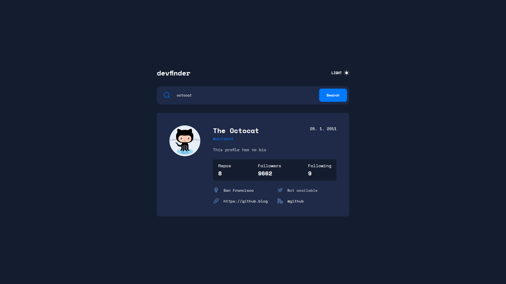
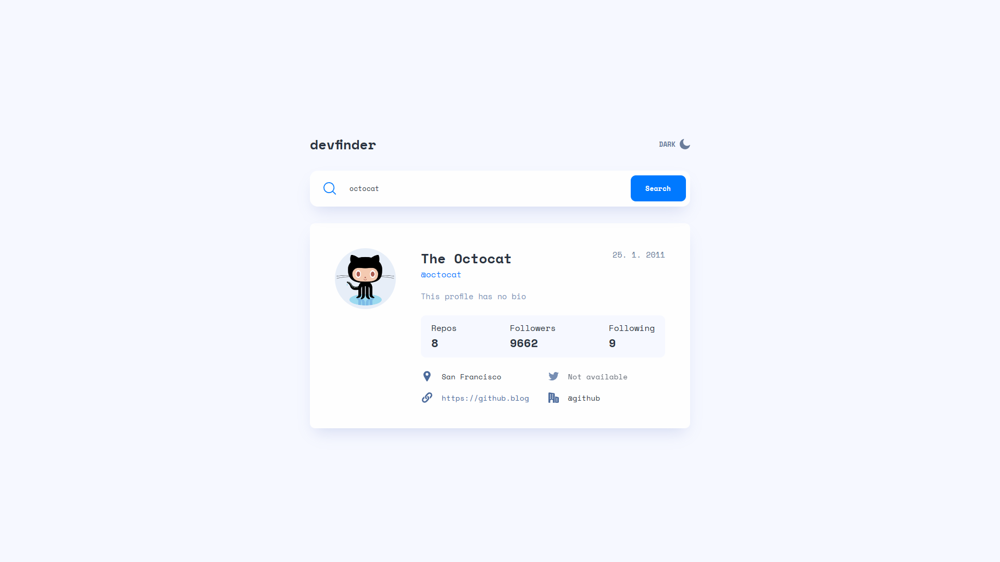
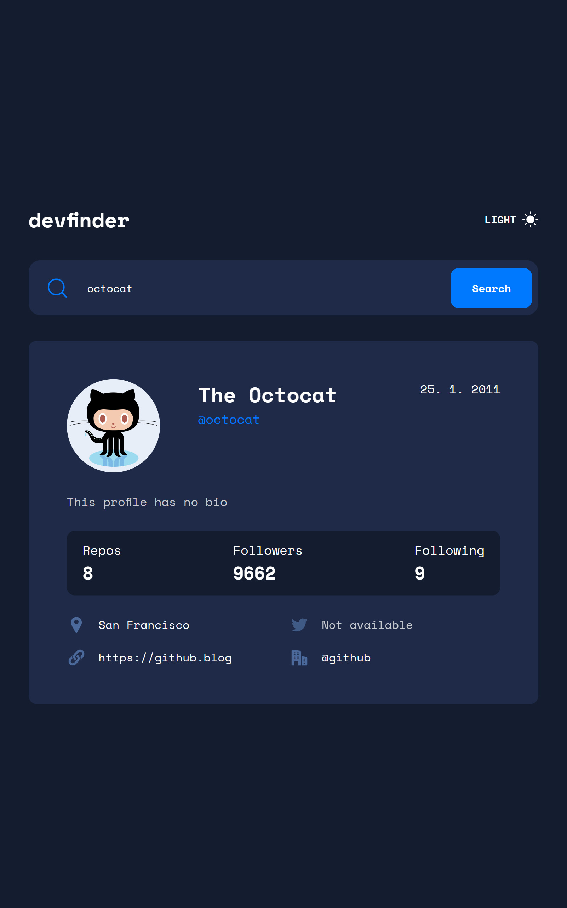
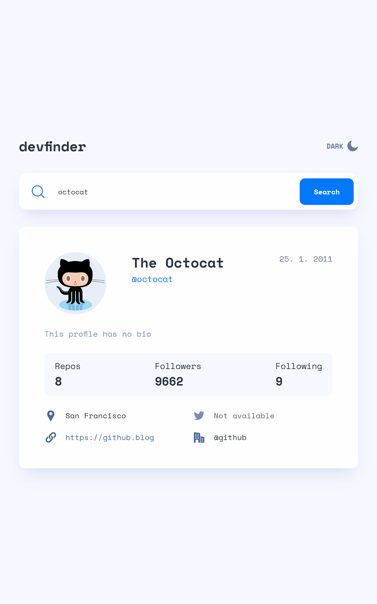
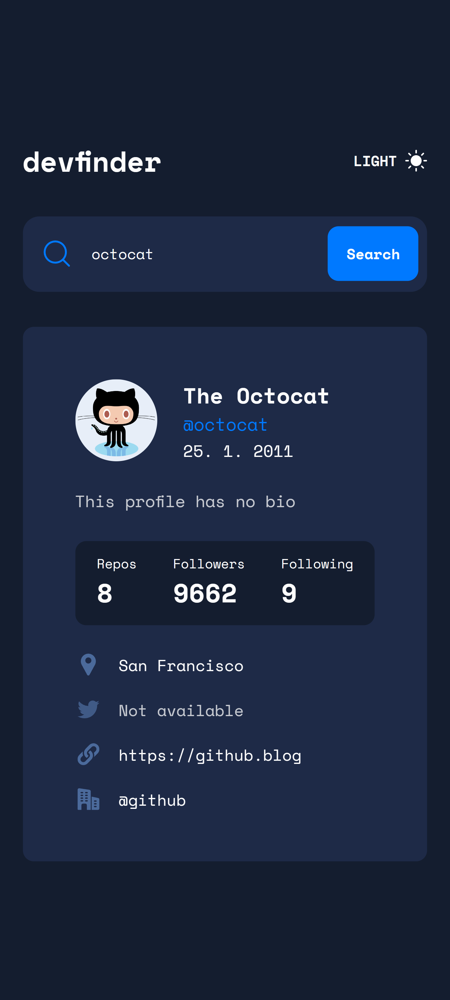
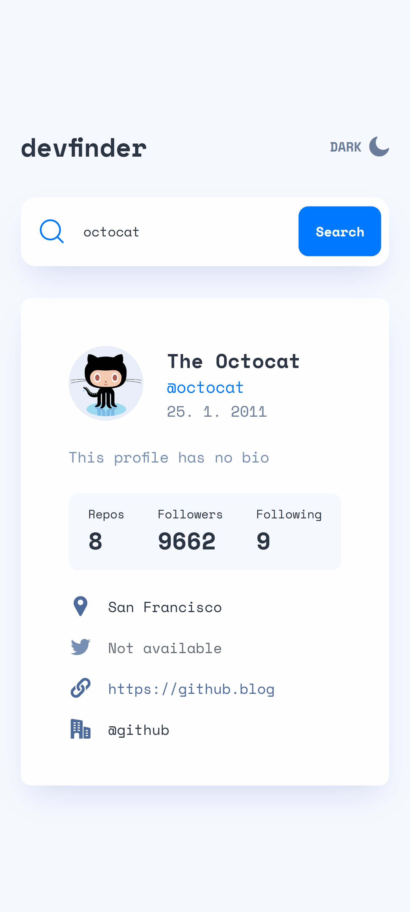

# Frontend Mentor - GitHub user search app solution

This is a solution to the [GitHub user search app challenge on Frontend Mentor](https://www.frontendmentor.io/challenges/github-user-search-app-Q09YOgaH6). Frontend Mentor challenges help you improve your coding skills by building realistic projects.

## Table of contents

- [The challenge](#the-challenge)
- [Built with](#built-with)
- [Screenshot](#screenshot)
- [Links](#links)

### The challenge

Users should be able to:

- View the optimal layout for the app depending on their device's screen size
- See hover states for all interactive elements on the page
- Search for GitHub users by their username
- See relevant user information based on their search
- Switch between light and dark themes
- **Bonus**: Have the correct color scheme chosen for them based on their computer preferences.

## Built with

- [Typescript](https://www.typescriptlang.org/) - JS superset
- [React](https://reactjs.org/) - JS library
- [Sass](https://sass-lang.com/) - CSS preprocessor
- [Octokit.js](https://github.com/octokit/octokit.js/) - API

## Screenshots

Screen:

Tablet:

Mobile:

## Links

- [GitHub Repo](https://github.com/ursasimenc/React-Devfinder)
- [Demo](https://devfinder-us.netlify.app/)
